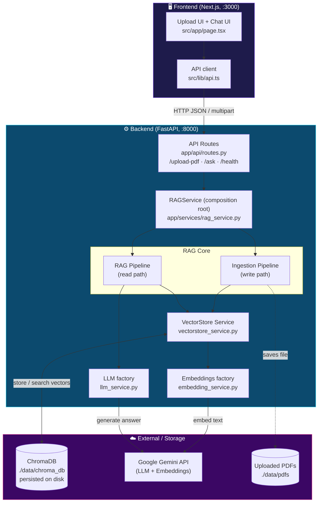
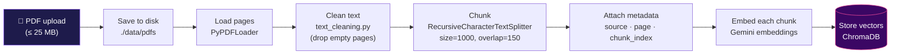
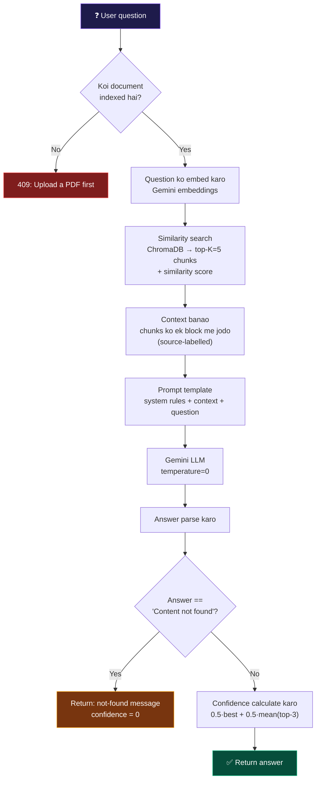
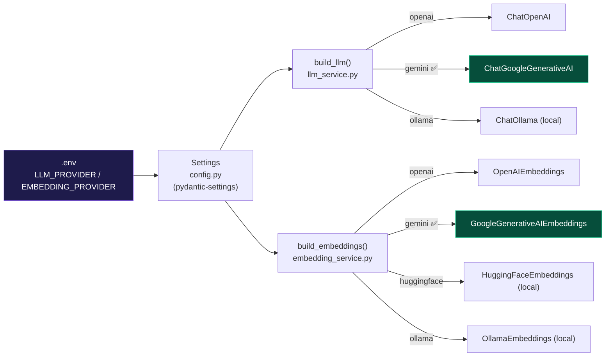
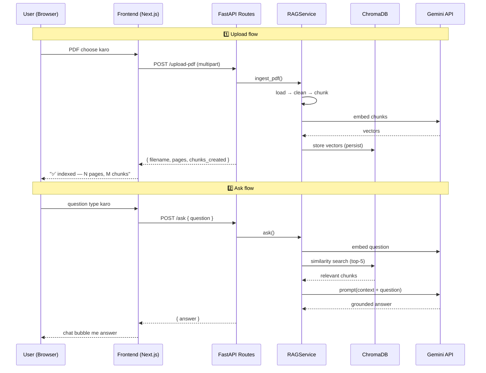

# ContextIQ — Architecture & How It Works

> **One-line summary:** ContextIQ ek RAG (Retrieval-Augmented Generation) app hai. Aap PDF upload karte ho, woh PDF ka text vector database (ChromaDB) me store hota hai, aur fir aap us PDF ke baare me sawaal pooch sakte ho — jawab **sirf** uss PDF ke content se aata hai, LLM ki apni knowledge se nahi.

---

## 1. App kis liye bani hai?

| | |
|---|---|
| **Problem** | Ek lambi PDF (report, manual, contract, notes) padhe bina usme se jawab nikalna mushkil hai. |
| **Solution** | PDF ko AI me "feed" karo, fir natural language me sawaal poocho. Jawab grounded (PDF-based) hota hai — hallucination kam. |
| **Guarantee** | Agar jawab PDF me nahi hai, to app saaf bolti hai: `"Content not found in the PDF."` — galat jawab nahi banati. |

**Do hisse hain:**
- **Backend** — FastAPI (Python), saara RAG logic. Port `8000`.
- **Frontend** — Next.js (TypeScript + Tailwind), upload + chat UI. Port `3000`. (folder: [frontend/](frontend/))

---

## 2. High-level architecture



---

## 3. Tech stack

| Layer | Technology |
|---|---|
| Frontend | Next.js 16, React 19, TypeScript, Tailwind v4 |
| Backend | FastAPI, Uvicorn, Pydantic v2 |
| RAG framework | LangChain (`langchain-core`, splitters, chroma, provider packages) |
| Vector DB | ChromaDB (persistent, on local disk) |
| LLM provider | **Gemini** (`gemini-flash-latest`) — switchable |
| Embeddings | **Gemini** (`models/gemini-embedding-001`) — switchable |
| PDF parsing | PyPDFLoader |
| Config | `pydantic-settings` reading from `.env` |

---

## 4. RAG kaise connected hai? — Do pipelines

RAG ke do hisse hote hain: **(A) Ingestion** (PDF ko index karna) aur **(B) Query** (sawaal ka jawab dena). Dono ka common point = **ChromaDB vector store**.

### 4A. Ingestion Pipeline — "Write path" (`POST /upload-pdf`)

> File: [app/rag/ingestion.py](app/rag/ingestion.py)



**Steps detail:**
1. **Load** — PDF ko per-page `Document` objects me todta hai.
2. **Clean** — har page ka text saaf karta hai; khaali pages hata deta hai. (Scanned image-only PDF → "no extractable text" error, kyunki OCR nahi hai.)
3. **Chunk** — bade text ko ~1000-character chunks me todta hai, **150 char overlap** ke saath (taaki context boundary pe na toote). Natural boundaries (`\n\n`, `\n`, `. `) prefer karta hai.
4. **Metadata** — har chunk pe `source` (filename), `page`, `chunk_index` lag jaata hai.
5. **Embed + Store** — har chunk ka vector banta hai (Gemini) aur ChromaDB me **persist** ho jaata hai (disk pe — restart ke baad bhi rehta hai).

### 4B. RAG Query Pipeline — "Read path" (`POST /ask`)

> File: [app/rag/pipeline.py](app/rag/pipeline.py)



**Key idea — Grounding:** LLM ko ek strict **system prompt** milta hai jo bolta hai:
- Sirf diye gaye context (PDF chunks) se jawab do.
- Bahar ki knowledge / assumptions mat use karo.
- Sirf jo poocha gaya hai utna hi answer do (minimal).
- Agar context me jawab nahi hai → exactly likho: `"Content not found in the PDF."`

Isiliye screenshot me "whats my name?" ka jawab "Prafull Shukla" aaya — woh aapki PDF (PrafullShukla.pdf) ke content se nikla, model ki guess se nahi.

> **Note:** `confidence` aur source chunks pipeline ke andar calculate hote hain, lekin API response me sirf `answer` bhejte hain (see [schemas.py](app/models/schemas.py) — `AskResponse` me sirf `answer` field hai). Future me chaaho to expose kar sakte ho.

---

## 5. LLM aur Embeddings kaise set hote hain? (Provider factories)

Pura system **config-driven** hai. `.env` ki do lines decide karti hain konsa provider use hoga:

```env
LLM_PROVIDER=gemini
EMBEDDING_PROVIDER=gemini
```

Code me kahin bhi provider hardcode nahi hai — do **factory functions** hain jo settings padhke sahi client bana dete hain:



- **LLM providers supported:** OpenAI, Gemini, Ollama
- **Embedding providers supported:** OpenAI, Gemini, HuggingFace (local), Ollama (local)
- **Abhi active:** dono **Gemini** (`GOOGLE_API_KEY` se).
- Provider switch karna = sirf `.env` badalna, code chhoona nahi padta. (Open/Closed principle.)

**Lazy LLM:** dhyaan dena — LLM tab tak nahi banta jab tak pehla `/ask` nahi aata ([rag_service.py:64-71](app/services/rag_service.py#L64-L71)). Isliye bina LLM key ke bhi PDF ingestion chal jaati hai.

---

## 6. Request flow (sequence) — end to end



---

## 7. Configuration knobs (`.env`)

| Variable | Abhi value | Kaam |
|---|---|---|
| `LLM_PROVIDER` | `gemini` | Konsa LLM provider |
| `EMBEDDING_PROVIDER` | `gemini` | Konsa embedding provider |
| `LLM_MODEL` | `gemini-flash-latest` | Chat model naam |
| `EMBEDDING_MODEL` | `models/gemini-embedding-001` | Embedding model naam |
| `CHUNK_SIZE` | `1000` | Har chunk ka max size (chars) |
| `CHUNK_OVERLAP` | `150` | Adjacent chunks ka overlap |
| `RETRIEVAL_TOP_K` | `5` | Har query me kitne chunks retrieve karne |
| `LLM_TEMPERATURE` | `0.0` | 0 = deterministic, factual (RAG ke liye sahi) |
| `LLM_MAX_TOKENS` | `1024` | Answer ki max length |
| `CHROMA_DB_PATH` | `./data/chroma_db` | Vector DB disk location |
| `CHROMA_COLLECTION_NAME` | `rag_documents` | Collection naam |
| `GOOGLE_API_KEY` | *(secret)* | Gemini API key — **kabhi commit mat karo** |

---

## 8. Folder structure

```
ContextIQ/
├── main.py                       # Entry point: uvicorn main:app
├── app/
│   ├── application.py            # FastAPI factory: CORS, lifespan, error handler
│   ├── api/routes.py             # 3 endpoints: /upload-pdf, /ask, /health
│   ├── core/
│   │   ├── config.py             # Settings (pydantic-settings) — single source of truth
│   │   └── logging_config.py     # Logging setup
│   ├── models/schemas.py         # Pydantic request/response models (API contract)
│   ├── rag/
│   │   ├── ingestion.py          # WRITE path: load→clean→chunk→embed→store
│   │   └── pipeline.py           # READ path: retrieve→context→LLM→answer
│   ├── services/
│   │   ├── rag_service.py        # Composition root (wires everything)
│   │   ├── embedding_service.py  # build_embeddings() factory
│   │   ├── llm_service.py        # build_llm() factory
│   │   └── vectorstore_service.py# ChromaDB wrapper (store + search)
│   └── utils/
│       ├── text_cleaning.py      # PDF text normalisation
│       └── exceptions.py         # Domain errors → HTTP status codes
├── data/
│   ├── chroma_db/                # Persisted vectors
│   └── pdfs/                     # Uploaded PDF files
├── frontend/                     # Next.js UI (upload + chat)
└── tests/                        # API + text-cleaning tests
```

---

## 9. API endpoints (quick reference)

| Method | Path | Body | Returns |
|---|---|---|---|
| `GET` | `/health` | — | `{ status, llm_provider, embedding_provider, documents_indexed }` |
| `POST` | `/upload-pdf` | multipart `file` | `{ message, filename, chunks_created, pages }` |
| `POST` | `/ask` | `{ question, top_k? }` | `{ answer }` |

**Error handling:** har domain error (invalid PDF, empty PDF, no documents, LLM failure) ek proper HTTP status code me convert hoti hai — see [exceptions.py](app/utils/exceptions.py) (400 / 409 / 422 / 500 / 502).

---

## 10. Design highlights (architecture ki khoobiyan)

- ✅ **Separation of concerns** — ingestion (write) aur query (read) alag pipelines.
- ✅ **Dependency injection** — `RAGService` composition root; baaki sab modules testable.
- ✅ **Provider-agnostic** — LLM/embeddings factory pattern; `.env` se switch.
- ✅ **Swappable storage** — sirf `VectorStoreService` Chroma ko jaanta hai.
- ✅ **Strict grounding** — system prompt hallucination rokta hai.
- ✅ **Persistent index** — restart pe re-ingestion nahi chahiye.
- ✅ **Async-friendly** — CPU/IO-bound kaam `run_in_threadpool` me, event loop free rehta hai.
```
